# LectureLens RAG Chatbot: System Architecture & Workflow

This document provides a comprehensive explanation of the system architecture, component integrations, workflow steps, and code snippets for the **LectureLens RAG Chatbot**.

---

## 🏗️ System Architecture

The chatbot utilizes a **Retrieval-Augmented Generation (RAG)** architecture with cloud-managed API backends to enable lightweight, fast execution. 

```mermaid
graph TD
    subgraph Data Ingestion
        A[PDF Lecture Notes] --> B[PyMuPDF Text Extraction]
        B --> C[Text Chunking overlap=100, size=500]
        C --> D[Gemini Embeddings gemini-embedding-001]
        D --> E[Pinecone Cloud Vector Store]
    end

    subgraph Chat Workflow
        F[User Query] --> G[Sleek Web UI /public]
        G --> H[FastAPI backend /api/chat]
        H --> I[Pinecone Similarity Retrieval]
        I --> J[Similarity Threshold Decider]
        J -- Score > 0.65 & Keyword Match --> K[RAG Prompt with Context]
        J -- Score <= 0.65 or Low Overlap --> L[Fallback Prompt]
        K --> M[Gemini 1.5 Flash LLM]
        L --> M[Gemini 1.5 Flash LLM]
        M --> N[Response + Source Pills]
        N --> G
    end
```



---

## ⚙️ Component Explanations & Code Snippets

### 1. Data Ingestion (`ingest.py`)
This script processes the PDF files in the `data/` directory, chunks the text, embeds them, and uploads them to the Pinecone index.

*   **API Rate Limit Handling**: Since the Gemini free-tier API has a limit of 15 Requests Per Minute (RPM) and 100 requests per minute total, sending all 883 chunks at once would crash the application with a `429 RESOURCE_EXHAUSTED` error. To prevent this, we batch the uploads in groups of 50 documents and pause for 10 seconds between batches.
*   **Automatic Dimension Verification**: The `models/gemini-embedding-001` model outputs 3072-dimensional vectors. The script automatically verifies that the Pinecone index dimension is exactly 3072, and deletes/re-creates the index if there is a mismatch.

#### Code Snippet: Ingestion & Rate-Limited Batching
```python
def create_vectorstore(chunks):
    print("Creating embeddings...")
    api_key = os.environ.get("PINECONE_API_KEY")
    index_name = os.environ.get("PINECONE_INDEX_NAME", "rag-project")
    
    embeddings = GoogleGenerativeAIEmbeddings(
        model="models/gemini-embedding-001",
        google_api_key=os.environ.get("GEMINI_API_KEY")
    )
    
    pc = Pinecone(api_key=api_key)
    existing_indexes = pc.list_indexes()
    index_exists = any(index.name == index_name for index in existing_indexes)

    # Automatically delete index on dimension mismatch to prevent upsert failures
    if index_exists:
        desc = pc.describe_index(index_name)
        if desc.dimension != 3072:
            pc.delete_index(index_name)
            index_exists = False

    if not index_exists:
        pc.create_index(
            name=index_name,
            dimension=3072,
            metric="cosine",
            spec=ServerlessSpec(cloud="aws", region="us-east-1")
        )
        while not pc.describe_index(index_name).status['ready']:
            time.sleep(2)

    db = PineconeVectorStore(index_name=index_name, embedding=embeddings, pinecone_api_key=api_key)
    
    # Upload in batches with sleep intervals to respect Gemini API quotas
    batch_size = 50
    for i in range(0, len(chunks), batch_size):
        batch = chunks[i:i + batch_size]
        db.add_documents(batch)
        if i + batch_size < len(chunks):
            time.sleep(10)
```

---

### 2. RAG & Fallback Decision Logic (`query.py`)
This module handles retrieving matching chunks, verifying keyword overlap relevance, and deciding whether to run a document-context prompt (RAG) or general-knowledge prompt (fallback).

*   **Similarity Metric Flip**: In FAISS, distance scores are L2 distances (lower is better, 0.0 is identical). In Pinecone Cosine Similarity, scores represent angles (higher is better, 1.0 is identical). We flipped the logic:
    *   **Old FAISS logic**: `score < THRESHOLD` (e.g. `score < 0.8`)
    *   **New Pinecone Cosine logic**: `score > THRESHOLD` (e.g. `score > 0.65`)
*   **Keyword Overlap Guard**: In addition to similarity, we check if the retrieved document chunk shares at least 2 distinct words with the user's query. This prevents the LLM from hallucinating answers based on unrelated chunks that have high semantic noise.

#### Code Snippet: Structured Query Evaluation
```python
def query_rag(query, db):
    docs_and_scores = db.similarity_search_with_score(query, k=3)
    chat_history_raw = memory.load_memory_variables({})["history"]
    chat_history = format_chat_history(chat_history_raw)

    best_score = docs_and_scores[0][1] if docs_and_scores else 0
    relevant_docs = [
        doc for doc, score in docs_and_scores if score > THRESHOLD
    ]

    use_rag = best_score > THRESHOLD and is_relevant(query, relevant_docs)

    if use_rag:
        context = "\n\n".join([doc.page_content for doc in relevant_docs])
        prompt = f"Chat History:\n{chat_history}\nContext:\n{context}\nUser: {query}"
        response = llm.invoke(prompt).content
        source = "document"
    else:
        prompt = f"Chat History:\n{chat_history}\nAnswer naturally using your knowledge.\nUser: {query}"
        response = llm.invoke(prompt).content
        source = "general"

    memory.save_context({"input": query}, {"output": response})
    return {
        "answer": response,
        "source": source,
        "docs": [{"content": doc.page_content, "metadata": doc.metadata} for doc in relevant_docs]
    }
```

---

### 3. FastAPI Backend (`/api/index.py`)
FastAPI acts as the lightweight web API that hooks into the query logic.
*   **System Integrity Endpoint (`/api/health`)**: Runs checks on startup to ensure `GEMINI_API_KEY` and `PINECONE_API_KEY` are successfully loaded, and queries index connectivity.
*   **Local File Mounting**: The backend mounts the `/public` static folder locally at the root route (`/`) using `StaticFiles`. This allows you to launch the entire system (backend and frontend) with a single command: `python api/index.py`.

---

### 4. High-Fidelity Front-End UI (`/public`)
We built a state-of-the-art Single Page Application (SPA) inside the `public/` directory:
*   **Aesthetics**: Glassmorphism borders, deep space background, elegant micro-animations (typing indicators, fade-in chat bubbles).
*   **RAG Citations Accordion**: If a response was generated `From document`, the UI displays a green pill. Clicking the collapsible **"View Retrieved Chunks"** dropdown reveals the exact text blocks pulled from Pinecone, complete with PDF document names and page numbers.
*   **System Indicators**: The sidebar queries `/api/health` on load to verify connection statuses.

---

### 5. Ragas Evaluation Framework (`evaluation_ragas.py`)
This script evaluates the retrieval and generation pipeline. Since the system uses Gemini API in production, we migrated Ragas from Ollama/FAISS to Gemini and Pinecone.
*   **Metrics Evaluated**:
    1.  **Faithfulness**: Assesses if the answer is grounded strictly in the retrieved context.
    2.  **Answer Relevance**: Assesses if the generated response directly answers the user query.
    3.  **Context Precision**: Assesses whether relevant context retrieved is ranked at the top.
    4.  **Context Recall**: Assesses if all necessary information to answer the question was retrieved.

---

## 🚀 How to Deploy on Vercel

Vercel natively supports hosting static assets and Python serverless functions seamlessly.

### File Structure for Vercel
```
RAG_project/
├── vercel.json        # Rewrites routes to serve static files and FastAPI backend
├── requirements.txt   # Backend python dependencies
├── api/
│   └── index.py       # Serverless function entry point
└── public/            # Static files served at the root URL
    ├── index.html
    ├── style.css
    └── script.js
```

### Vercel Configuration (`vercel.json`)
The routing configuration redirects all requests starting with `/api/` to our FastAPI backend (`/api/index.py`), while mapping other routes directly to files inside the `/public` directory.
```json
{
  "rewrites": [
    {
      "source": "/api/(.*)",
      "destination": "/api/index.py"
    },
    {
      "source": "/(.*)",
      "destination": "/public/$1"
    }
  ]
}
```

### Step-by-Step Deployment Instructions

1.  **Push to GitHub**:
    Ensure your GitHub repository has your code. Do **NOT** push your `.env` file (it is ignored by `.gitignore`).
2.  **Sign in to Vercel**:
    Go to [vercel.com](https://vercel.com) and log in with your GitHub account.
3.  **Import Project**:
    Click **"Add New"** > **"Project"**, select your repository, and click **"Import"**.
4.  **Configure Environment Variables**:
    Under the **Environment Variables** section in the deployment settings, add the following variables:
    *   `GEMINI_API_KEY` = *your_gemini_api_key*
    *   `PINECONE_API_KEY` = *your_pinecone_api_key*
    *   `PINECONE_INDEX_NAME` = `rag-project`
5.  **Deploy**:
    Click **"Deploy"**. Vercel will automatically configure the Python runtime, install your requirements, and provide a live URL!
